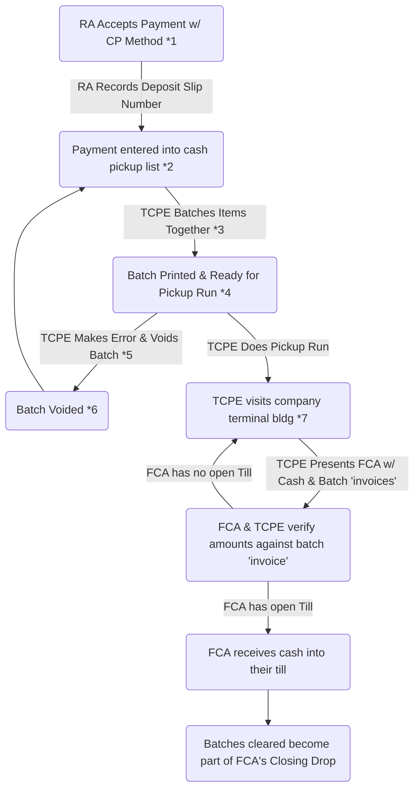

## Actors/Roles
- Reservation Agent (RA)
- Trusted Cash Pickup Employee (TCPE)
- Front Counter Agent (FCA)

## Process Flow

### Footnotes
1. From this point forward from the reservation's point of view and for the purposes of check-in this reservation is paid.  We become the collectors now.
2. The PAYMENT is now entered into the list of items to be picked up
3. This is a PRIVELEGED action and should not be available to just anybody.  Once a reservation payment is a member of batch it cannot be associated with any other live batch.
4. The trusted employee uses the batch print to go perform the actual collections
5. Its possible that the trusted employee may have made an error when creating the batch. Maybe included something that should not have been included. It happens for more reasons than we can enumerate here.  As long as the batch has not progressed any further then they should be able to void the batch.
6. All payment items associated with the batch should be released and be able to be re-associated with a NEW batch.
	1. Voiding a batch should be tracked for historical reasons.
7. The trusted employee is out on the run at this point collecting cash and counting it in person, verifying the amounts against the batch 'invoice' they have in their possession.  At the completion of the run they physically visit a front counter.