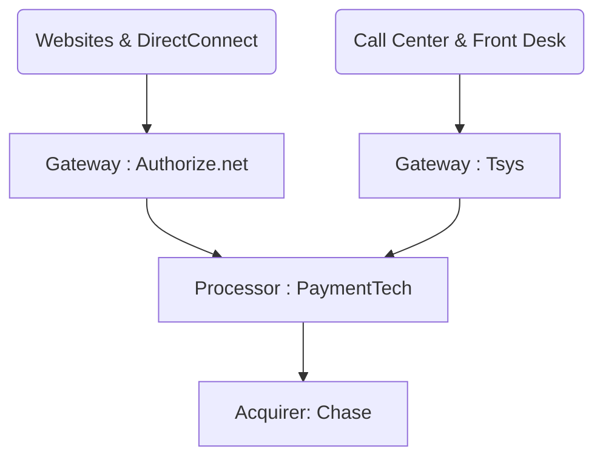
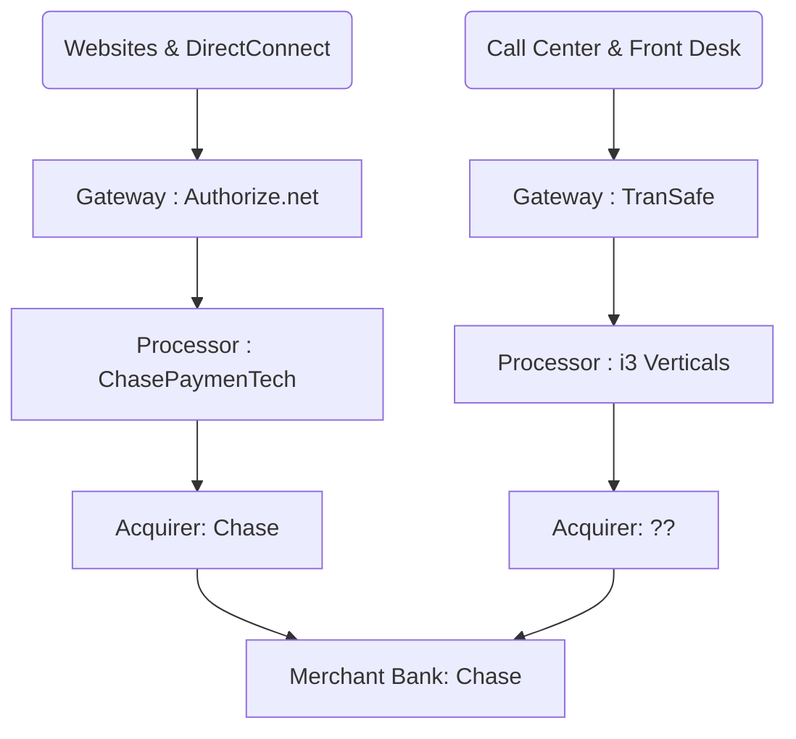

135ACM has existing integrations with the processor and gateway provider i3 Verticals / TranSafe. At the moment its the only integrated payment system 135CAM has.  Neither of our accounting departments are comfortable with i3 Verticals and they have not made a good impression thus far. 

Both Papillon & GCSA accounting departments have expressed reservations about:
- Not being given a choice in processors or technologies
- The lack of history or familiarity with i3 Verticals
- The impression that the decision of the processor and gateway have been railroaded

### Current Card Payment Pipeline Entity Flow

- Papillon is confirmed on this structure.  GCSA likely similar if not identical

### Proposed Transaction Processing Structure

## Notes and History
- 2024-01-04 : 135ACM live tests the Lane 5000 equipment locally in BC
- 2024-01-25 : i3 Verticals Interface with Papillon (Barb [[Core Papillon Accounting|**]] and Mark Weatherford [[i3 Verticals & TranSafe|**]])
	- outcome very negative, i3 gave impressions of being dismissive and not forthcoming.  
	- created impression that Authorize.net would not be compatible with the payment process moving forward.  This was a dead-stop item.
	- Weeks spent untangling this mess.  Potential misunderstanding or i3 changed their tune.
- 2024-02-19 : 135ACM (Wolf [[135ACM Team|**]]) requests payment principals meeting
- 2024-03-07 : Online meeting with Barb, Dante [[Core GCSA Accounting|**]], Wolf, and Coy [[Engineering & Integration|**]] see the [[Meeting 2024-03-07 Credit Card Processing|meeting notes]]
- 2024-03-13 : Mark W. Delivers references to Barb
- 2024-03-20 : Deep dive meeting w/ current payment vendors proposed
- 2024-03-25 : Clarification call with i3, 135ACM, and Coy [[Meeting 2024-03-25 Credit Card Follow-on Discussion|*]] , updated charts as a result
- 2024-03-27 : Mark W. Delivers [[TranSafe VT Guide 1.0.pdf|TranSafe User's Guide]] as well as demo login credentials.
- 2024-04-03 : Coy determines that the TranSafe virtual terminal is NOT an adequate replacement for Authorize.net & AcceptJS
	- A conversation established that the VT was not the right solution,  Mark commits to get coy the api docs by 4-4 to 4-5

## i3 Verticals

### Pricing:
- New MID setup and integration with ACM: Waived
- Wholesale Interchange with downgrade audit
- V/MC/Disc/Amex Interchange plus 0.12%
- Per item fee: $0.03
- Gateway authorization fee: $0.03
- Annual PCI fee $95

According to the comparison we did back in July 2022, the above pricing will reduce your effective rate from:
- 2.95% Chase Bank) to 2.70% at Papillon Airways Inc
- 3.09% (Chase Bank) to 2.87%
### References:
* Handcrafted Restaurants ( 7 locations): Laura Blaho- Controller 808-263-0849
* Air Maui/Air Kauai: Virginia DiPiazza- GM 808-877-0416
* 5 Star Helicopters: John Power-President 702-565-7827
* HI Tech Surf Sports (5 locations): Kim Ball- President 808-877-2111
* Aqualani Resort Recreation Management (34 locations): Alexis Sambrano-Controller 310.469.8276

## Meeting Notes
- [[Meeting 2024-03-07 Credit Card Processing| GCA/Papillon/i3/135ACM - 2024-03-07 ]] 
- [[Meeting 2024-03-25 Credit Card Follow-on Discussion|Pap/i3/135ACM - 2024-03-25]]