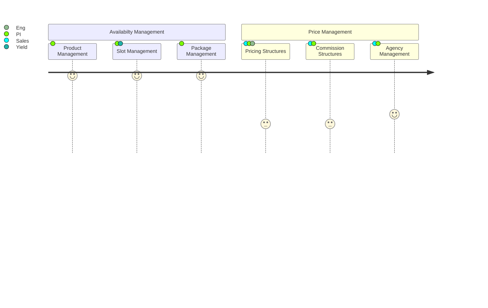
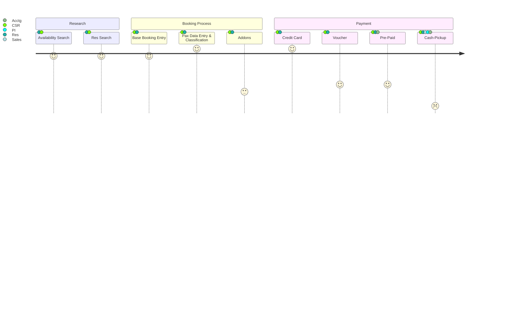
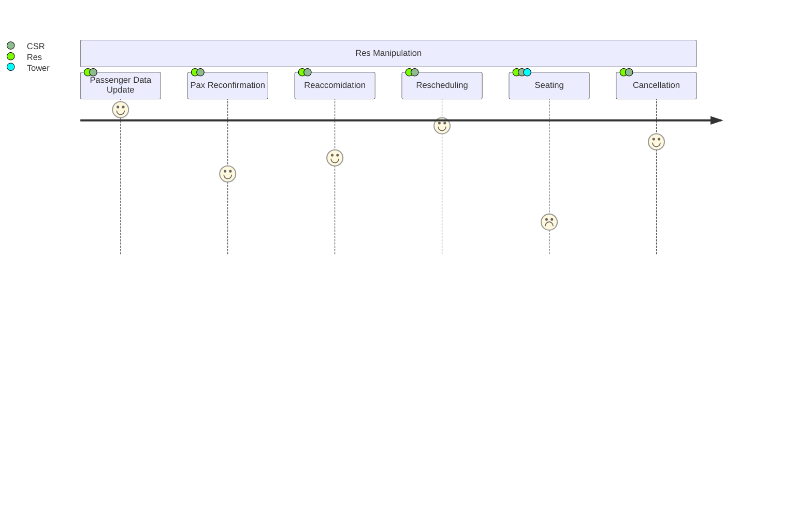
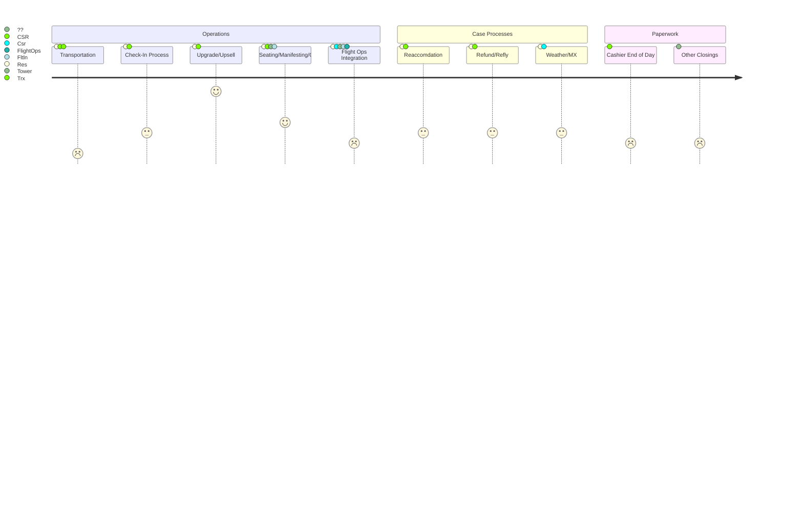
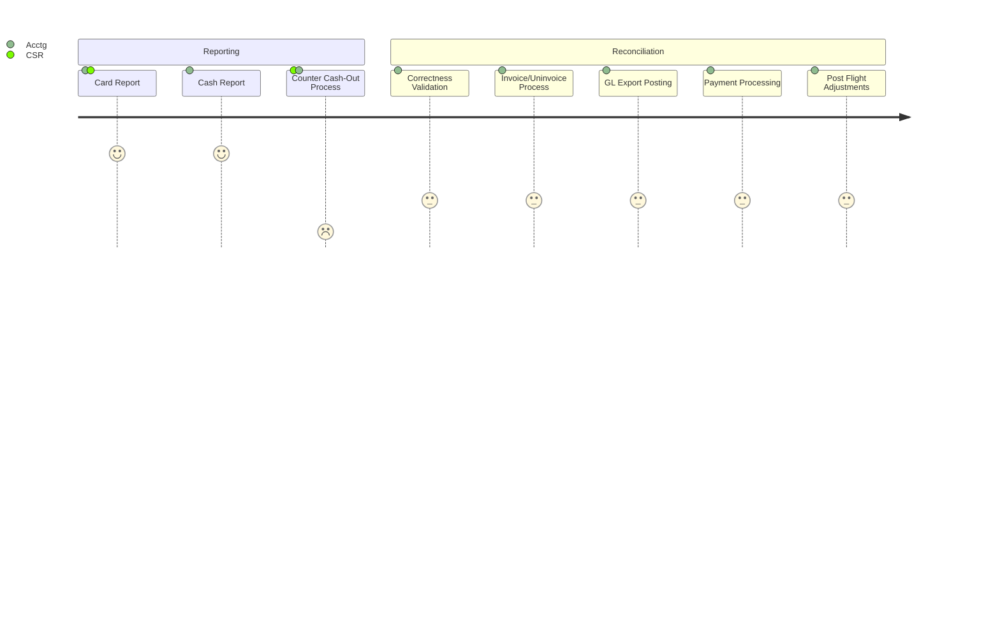

## // Phase 1 - The Origin of Data

---

## // Phase 2 : The Reservation Advent

### Useability Questions & Concerns
- Questions Pending
	- How to you find people with misspelled names
	- How do you search by alternate identifiers
		- Email, Phone, Guarantee Number (may be alpha)

---

# // Phase 3: The Living & Evolving Res

### Special Case Considerations
- Possible scenarios include
	- Cancellation Policy
	- Cancelation Protection
### Reservation Reconfirmation
- Reservations is included in either an "isReconfirmed" or not.  This meaning that:
	- the passenger has contacted the reservation to confirm their details.
	- the passenger has been contacted by the res center
	- neither of those have happened in which case we need to reach out 

---

# // Phase 4: Executing on the Reservation

---

# // Phase 5 : Accounting, Verification, Billing

---
## Meeting Notes
- 2024-03-15 / [[2024-03-15_reservations_update|Notes]]
- 2024-03-15 / [[2024-03-20_reservations_update|Notes]]