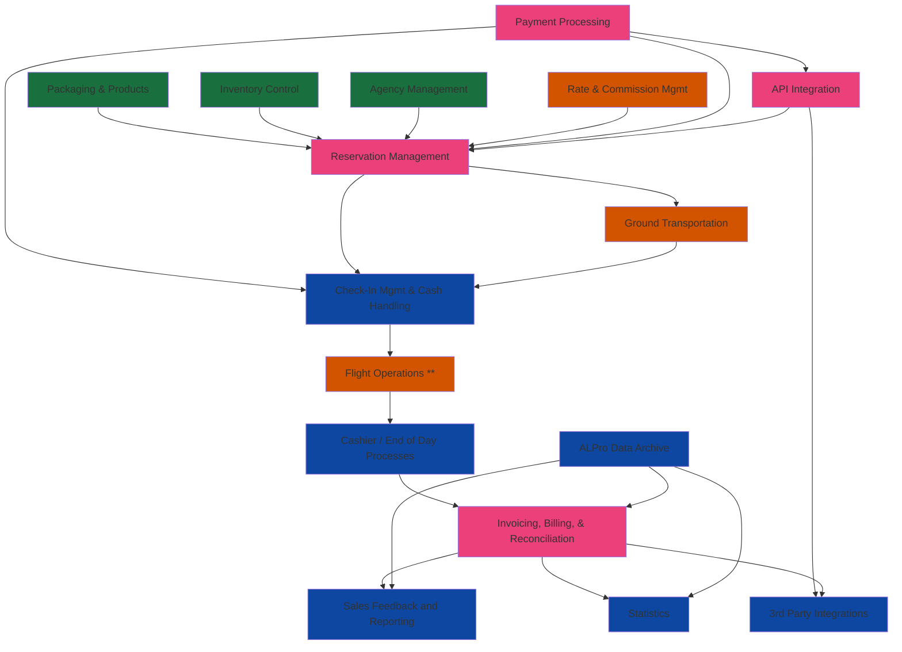

Current as of 2024-03-26
## Working Goals:
* [[Reservation Life Cycle]] ( In Progress )
* [[Flight Operation Life Cycle]] ( Exists / Integration Not Started )
* [[Credit Card Processing]] ( In Progress ) 

## Additional Indexes
- [[Team Index|Subject Matter Experts Index]]
